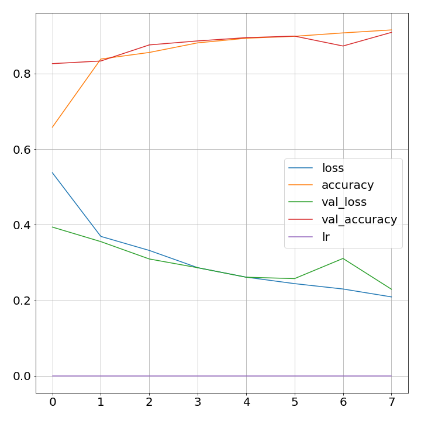
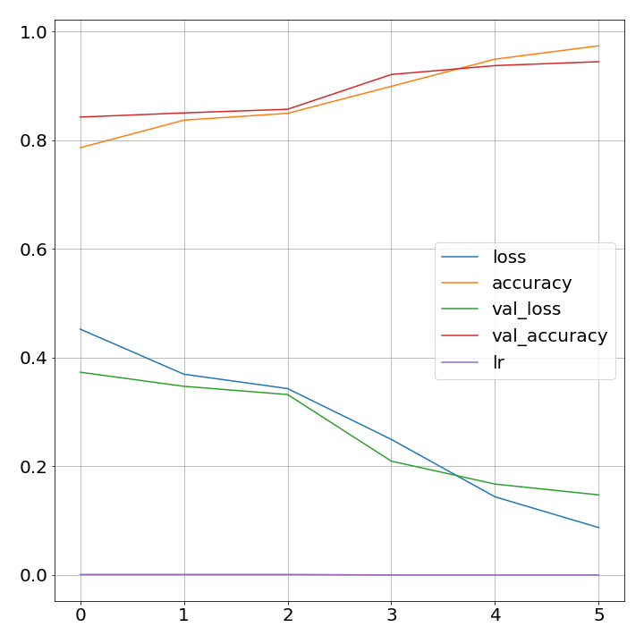
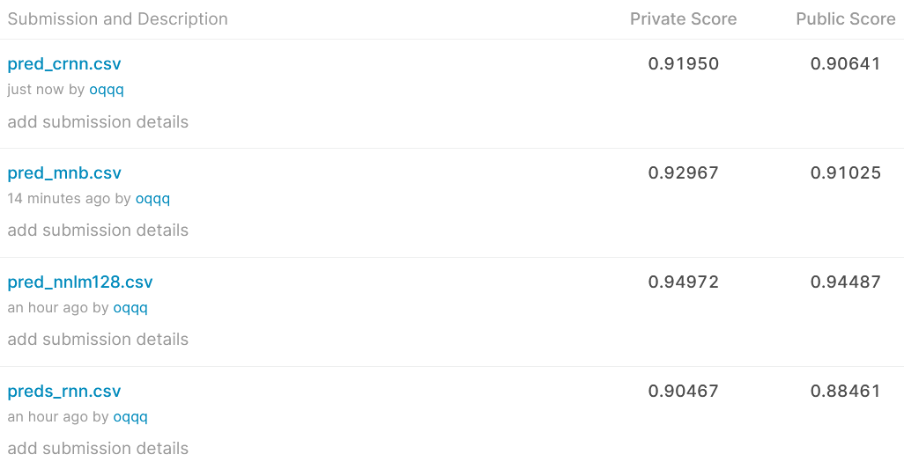

# fakenews_text_classification

# Objective
Try different classification models on the fake news dataset provided by kagggle https://www.kaggle.com/c/fake-news/submissions

The models that were used are:
* Neural Network model with Bi-directional reccurant LSTM cell layer. Stanford's Glove-300d embeddings were used in the input layer.
* Neural Network model with conventional, max-pooling and reccurant/LSTM-cell layers. Stanford's Glove-300d embeddings were used in the input layer. 
* Pre-trained NNLM 128 Model (https://tfhub.dev/google/nnlm-en-dim128/2) embedding layer with dense classifier layer.
* Naive Bayes.

# Results

### Bi-directional reccurant LSTM cell model accuracy and loss plots

  
### Conventional and reccurant LSTM cell model accuracy and loss plots
!conventional and reccurant LSTM cell model accuracy and loss plots](plots/history_crnn.png)
  
### NNLM 128 Embedding

  

Test scores accroding to kaggle:

