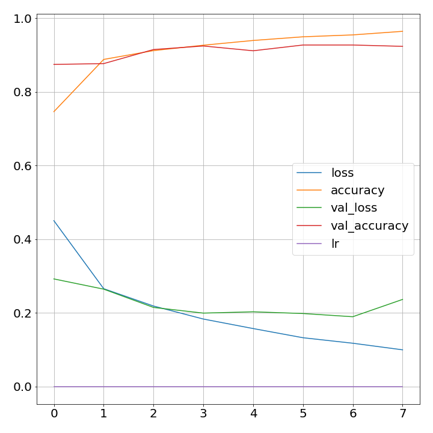

# fakenews_text_classification

# Objective
Try different classification techniques on the fake news dataset provided by kagggle https://www.kaggle.com/c/fake-news/submissions

The Machine Learning models that were used are:
* Neural Network model with Bi-directional reccurant LSTM cell Layer. Glove embeddings were used in the input layer.
* Neural Network model with conventional and reccurant/LSTM-cell layers. Glove embeddings were used in the input layer. 
* Pre-trained NNLM 128 Model (https://tfhub.dev/google/nnlm-en-dim128/2) embedding layer with dense classifier layer.
* Naive Bayes

# Results

Test scores accroding to kaggle:

